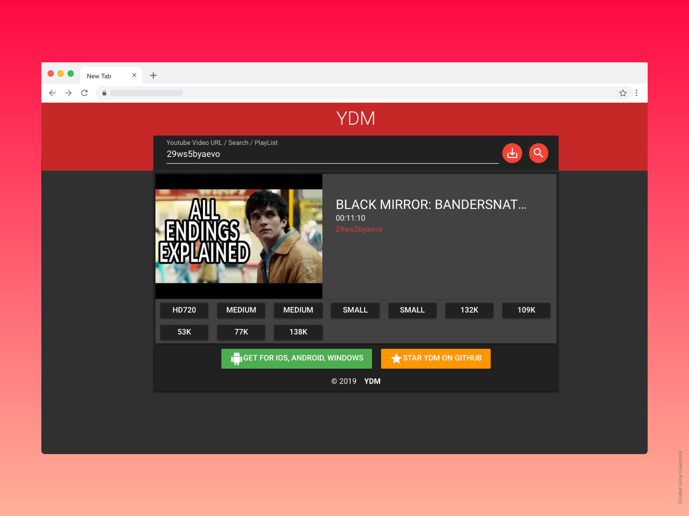
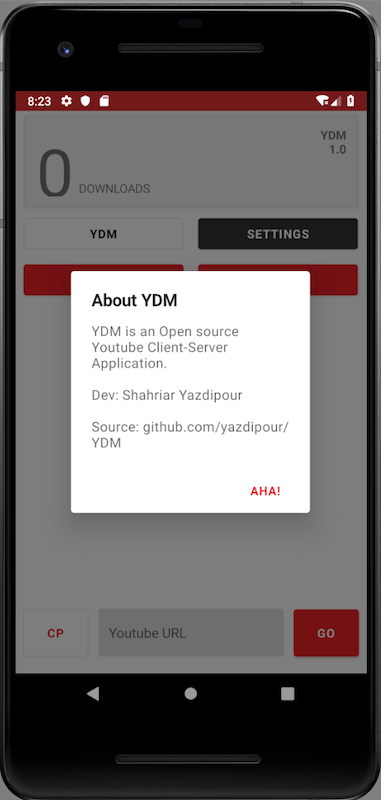
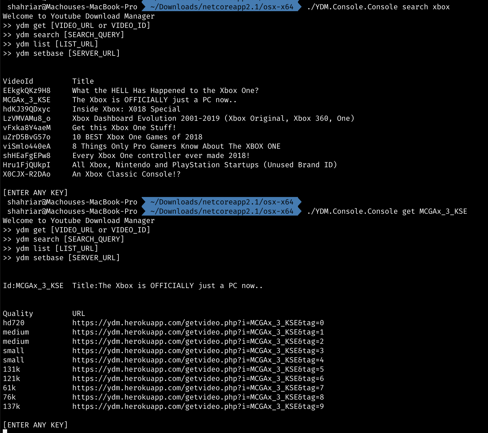

# YDM

> YDM is an open source youtube download manager, you can download videos from your own server.

| Platform   | ToDo  | Technology  | Build (dev branch) | Published
|------------|------|---------------|-------|------|
| Server[[repo][ydm-server]] |  [🔗][todo1]  | PHP |  | https://ydm.herokuapp.com
| WebApp |  [🔗][todo2]  | VueJS | - | https://yazdipour.github.io/ydm/
| ConsoleApp |  [🔗][todo3]  | C# (.NetCore) | - | [Get for win-osx-linux](https://github.com/yazdipour/ydm/releases)
| UWP        |  [🔗][todo4]  | C# (Native)   | ![Build status][uwpbbadge] | [Get from MS-Store][msstore]
| Android    |  [🔗][todo5]  | C# (XamarinForms)   | ![Build status][andbadge] | [Get TestAPK (Appcenter)][andapk]
| iOS        |  [🔗][todo6]  | C# (XamarinForms)   | ![Build status][iosbadge] | (I dont have AppleDev Account)

## Screenshots

| iOS | Android | UWP | Console |
| --- | --- | --- | --- |
|  |  |  |  |

### Developer Note

> I don't have much experience in most of the technologies I used in this project. I would be happy to see your Feedbacks and PRs.

## Maybe 🥺 Donate

[iosbadge]:https://build.appcenter.ms/v0.1/apps/0fbbf24b-295b-49a7-9597-9f63d90459bd/branches/dev/badge
[andbadge]:https://build.appcenter.ms/v0.1/apps/04b96dc5-679f-4a07-89e1-bedb936590b2/branches/dev/badge
[uwpbbadge]:https://build.appcenter.ms/v0.1/apps/a8d27600-4399-4bd7-ad04-d1921096b710/branches/dev/badge
[ydm-server]:https://github.com/yazdipour/ydm-server
[ydm]:https://yazdipour.github.io/ydm/
[msstore]:https://www.microsoft.com/en-us/p/ydm/9pltn8lxg7m4?rtc=1
[andapk]:https://install.appcenter.ms/users/yazdipour/apps/ydm.android/distribution_groups/testers
[todo1]: https://github.com/yazdipour/ydm/projects/8
[todo2]: https://github.com/yazdipour/ydm/projects/6
[todo3]: https://github.com/yazdipour/ydm/projects/5
[todo4]: https://github.com/yazdipour/ydm/projects/1
[todo5]: https://github.com/yazdipour/ydm/projects/4
[todo6]: https://github.com/yazdipour/ydm/projects/4