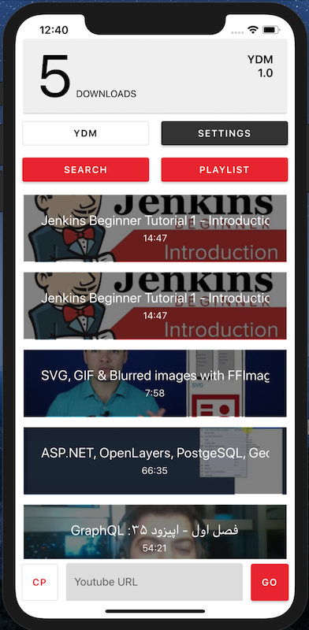
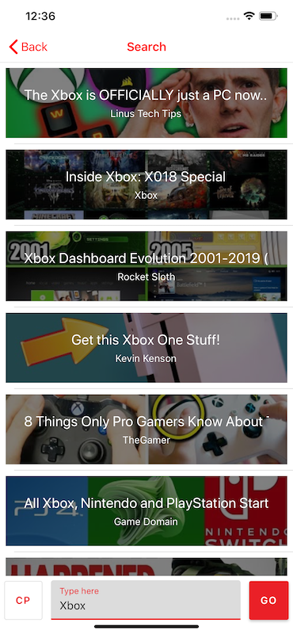
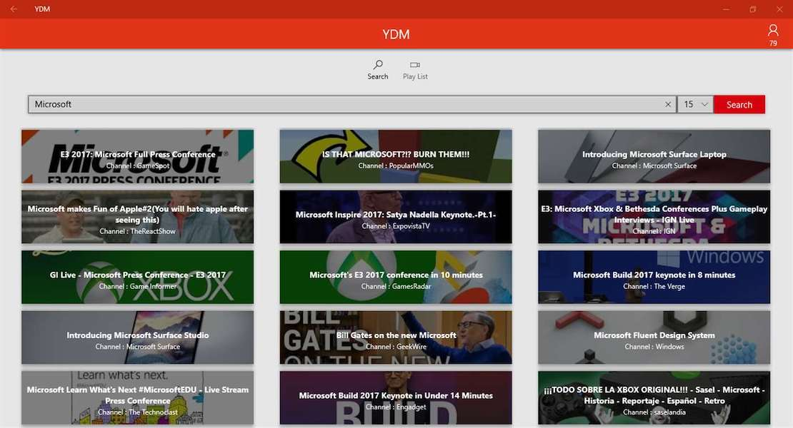

# YDM

> YDM is an open source youtube download manager, you can download videos from your own server.

| Platform   | Technology    | Build (dev branch) | Published
|------------|---------------|-------|------|
| [Server](https://github.com/yazdipour/ydm-server) | PHP |  | ydm.herokuapp.com
| WebApp | - | - | -
| ConsoleApp | C# (.NetCore) | - | [Get for win-osx-linux](https://github.com/yazdipour/YDM/releases)
| UWP        | C# (Native)   |  | [Get from MS-Store](https://www.microsoft.com/en-us/p/ydm/9pltn8lxg7m4?rtc=1)
| Android    | C# (XamarinForms)   |  | [Get TestAPK (Appcenter)](https://install.appcenter.ms/users/yazdipour/apps/ydm.android/distribution_groups/testers)
| iOS        | C# (XamarinForms)   |  | (I dont have AppleDev Account)

## TASKS

* [ ] `Issue` There is no proper Video Streaming [Xamarin Forms]
* [ ] `Issue` Video Downloading inside Application [Xamarin Forms]
* [x] `Issue` Codes are not writen in MVVM form, so clean it
* [ ] `Feature` List Channel Videos [YDM.Share]
* [ ] `Feature` Bookmark User Channels
* [ ] Write Test
* [ ] Improve Docs
* [ ] Releasing an excutable version of Console Application
* [ ] Developing for MacOS
* [ ] Developing Client WebSite
* [ ] `BUG` I guess Server can't rewrite Cache (Maybe Remove Cache Feature!)
* [ ] Refactor Old UWP Codes

## Screenshots

iOS

UWP

### Developer Note

> I don't have much experience in Xamarin and developing Shared project. I would be happy to see your PR and Issues.